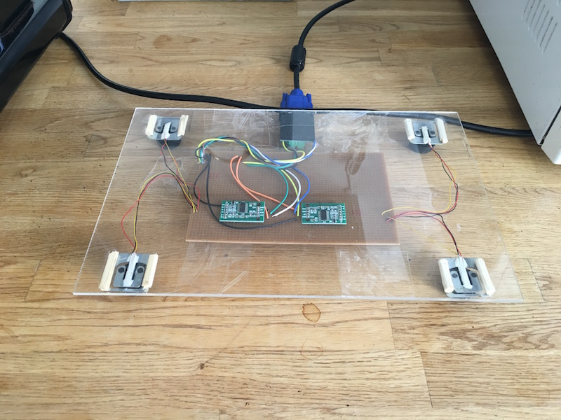
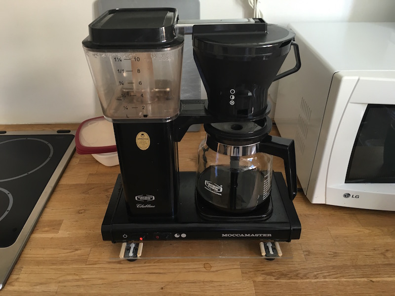
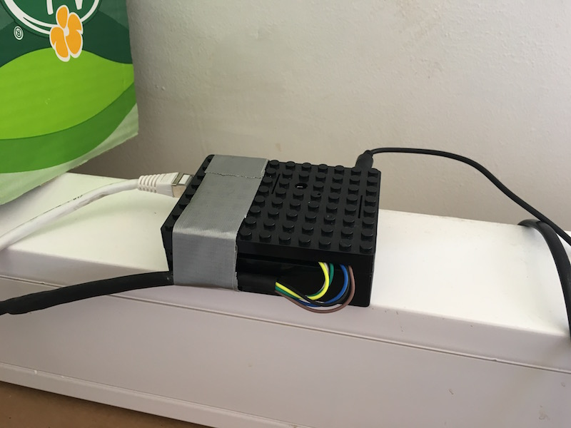

	   ___       __  __               ___ _   _ _   
	  / __\___  / _|/ _| ___  ___    / _ (_)_(_) |_
	 / /  / _ \| |_| |_ / _ \/ _ \  / /_)// _ \| __|
	/ /__| (_) |  _|  _|  __/  __/ / ___/| (_) | |_
	\____/\___/|_| |_|  \___|\___| \/     \___/ \__|

# Coffee brewing DIY team project by A3J
Early 2016 we set off to once and for all rectify all our worries surrounding the daily brewing routines. The result is this DYI project that enables us (you) to view the state of the coffee brewer in your (our) OSX app tray. Which in turn enables us (you) to make more qualified decisions with regards to the planning of your coffee fetching promenades.

## Download app

[Click me now](https://www.dropbox.com/sh/3p1ihi4qmqhcajp/AACz9GGPd7lTfymZW9CS5mPIa?dl=0)

## The scale
In order to detect the state of the coffee brewer, on the hardware side, we decided that our best chances were to determine the weights on the left/right hand sides of the brewer.

## Hardware
- Raspberry PI
- Load cells (extracted from a kitchen scale)
- Cables
- Serial port & cable
- Soldering station
- Various tools
- Gaffa tape

## The software
In order to continously detect the state of the brewer we need to poll the physical scale every x seconds. We decided to create a buffered stream of polls in order to be able to analyse what happens over time.

In order to make it easier to detect states, a finite state machine was implemented, and from there on we only hade to try and detect 1-2 different state transitions given the current state.

## The stack
- C++
- Node
- RxJS
- JavaScript State Machine (jakesgordon)
- ws (Websockets)
- Electron

## Run
The software is divided into two parts, the electron app and the server that is responsable for communicating with the scale and distributing messages to the electron app instances over websocket connections.
[...]

## What the future looks like
Here are a few ideas that has been mentioned regarding future development of this app:

- Being able to claim a particular brew
- Saving stats for who brewed what and when
- Detecting who drinks what and when

## Wiring

[Sketch](docs/wiring_sketch.jpg)

[Getting started with load cells](https://learn.sparkfun.com/tutorials/getting-started-with-load-cells)

[hx711 Hookup guide](https://learn.sparkfun.com/tutorials/load-cell-amplifier-hx711-breakout-hookup-guide)

[Hx711 documentation](docs/Hx711_english.pdf)

